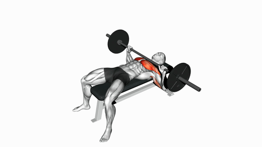
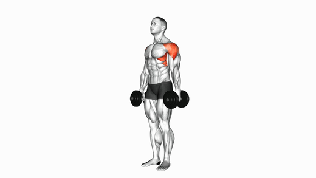
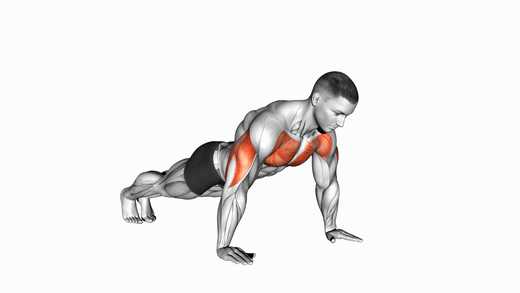

# Free Exercise DB with Videos

**A free, open-source exercise database and REST API with real male and female demo videos.**

317 exercises, 593 Full-HD demo videos (male and female), plus step-by-step instructions, form
cues, common mistakes, breathing notes and thumbnails for every exercise. No API key, no database,
MIT licensed, and self-hostable in one click.

<p>
  
  
  
  
  
</p>

If you are looking for a free exercise API, exercise database, or exercise video API, this is a
zero-cost, self-hostable alternative to ExerciseDB and wger — with an actual demo video for every
movement, filmed for both a male and a female model.

## Live demo

A hosted instance is available for evaluation:

**Website:** https://free-exercise-db-with-videos.vercel.app
**API:** https://free-exercise-db-with-videos.vercel.app/api/v1/exercises

```bash
curl "https://free-exercise-db-with-videos.vercel.app/api/v1/exercises?bodyPart=chest&limit=1"
```

The hosted demo is intended for testing and evaluation. For production use, clone the repository and
run your own instance (below) — it is free and requires no database or API key.

## What the videos look like

Every exercise ships with a Full-HD (1920×1080) video for a male and a female model, plus a matching
thumbnail. A few examples, shown here as short looping previews:

<table>
  <tr>
    <td align="center"><br><sub><b>Barbell Bench Press</b></sub></td>
    <td align="center"><br><sub><b>Dumbbell Lateral Raise</b></sub></td>
    <td align="center"><br><sub><b>Push-Up</b></sub></td>
  </tr>
</table>

The previews above are compressed GIFs. The actual files are full-resolution 1080p MP4s. Below is one
example thumbnail at native resolution:


### Example media links

Open, download, or share these directly:

| Exercise | Video (male) | Video (female) | Thumbnail |
|---|---|---|---|
| Barbell Bench Press | [MP4](https://pub-585d42eb1aa64a67aedf483ec328d3fe.r2.dev/exercise-videos/male/barbell-bench-press.mp4) | [MP4](https://pub-585d42eb1aa64a67aedf483ec328d3fe.r2.dev/exercise-videos/female/barbell-bench-press.mp4) | [JPG](https://pub-585d42eb1aa64a67aedf483ec328d3fe.r2.dev/exercise-posters/male/barbell-bench-press.jpg) |
| Dumbbell Lateral Raise | [MP4](https://pub-585d42eb1aa64a67aedf483ec328d3fe.r2.dev/exercise-videos/male/dumbbell-lateral-raise.mp4) | [MP4](https://pub-585d42eb1aa64a67aedf483ec328d3fe.r2.dev/exercise-videos/female/dumbbell-lateral-raise.mp4) | [JPG](https://pub-585d42eb1aa64a67aedf483ec328d3fe.r2.dev/exercise-posters/male/dumbbell-lateral-raise.jpg) |
| Push-Up | [MP4](https://pub-585d42eb1aa64a67aedf483ec328d3fe.r2.dev/exercise-videos/male/push-ups.mp4) | [MP4](https://pub-585d42eb1aa64a67aedf483ec328d3fe.r2.dev/exercise-videos/female/push-ups.mp4) | [JPG](https://pub-585d42eb1aa64a67aedf483ec328d3fe.r2.dev/exercise-posters/male/push-ups.jpg) |

## Why this exists

Most free exercise APIs give you names and, at best, a GIF. This one provides a real video
demonstration of every exercise — for a male and a female model — alongside genuinely useful coaching
metadata (ordered steps, form cues, common mistakes, breathing). It runs with no database and no API
key, so cloning it and deploying to Vercel costs nothing.

| | This project | Typical free exercise DBs |
|---|---|---|
| Real demo videos (male and female) | Yes — 593 videos | GIFs or nothing |
| Step-by-step instructions | Yes | Sometimes |
| Form cues and common mistakes | Yes | Rarely |
| Runs with no infrastructure or key | Yes | Varies |
| License | MIT | Varies |

## Quick start

```bash
git clone https://github.com/amiinwani/free-exercise-db-with-videos
cd free-exercise-db-with-videos
npm install && npm run dev
# API at http://localhost:3000/api/v1/exercises
```

## Set it up with an AI agent

Paste the following into Claude Code, Cursor, or any coding agent to have it perform the setup:

```text
You are setting up a free, open-source exercise database with real demo videos.

1. Clone the repo:
   git clone https://github.com/amiinwani/free-exercise-db-with-videos
   cd free-exercise-db-with-videos

2. Install and run the API locally:
   npm install && npm run dev
   # API live at http://localhost:3000/api/v1/exercises
   # (or deploy to Vercel for a free public instance — see the Deploy button in the README)

3. (Optional) Download every video and thumbnail locally:
   bash scripts/download-all-videos.sh
   # pulls all 593 videos and posters into ./videos and ./thumbnails

4. The full dataset is data/exercises.json — 317 exercises, each with male and female
   video URLs, thumbnails, step-by-step instructions, form cues, common mistakes and
   breathing. Query it via GET /api/v1/exercises
   (filters: bodyPart, equipment, target, difficulty, search, limit, offset).
```

## API reference

Base URL `/api/v1`. Responses are JSON with a `{ success, count?, data }` envelope. No auth.

| Method | Endpoint | Description |
|---|---|---|
| GET | `/api/v1/exercises` | List and filter. Query: `bodyPart, equipment, target, difficulty, search, limit, offset` |
| GET | `/api/v1/exercises/:id` | One exercise by id |
| GET | `/api/v1/search?q=` | Search by name, alias, target or muscle |
| GET | `/api/v1/bodyparts` | Body-part facets with counts |
| GET | `/api/v1/equipment` | Equipment facets with counts |
| GET | `/api/v1/targets` | Target-muscle facets with counts |

```json
{
  "success": true,
  "count": 57,
  "data": [{
    "id": "0489",
    "name": "45 Degree Hyperextension",
    "bodyPart": "back",
    "target": "erector spinae",
    "equipment": "leverage machine",
    "difficulty": "beginner",
    "steps": ["…"],
    "formCues": ["Keep back straight", "Hinge from hips"],
    "commonMistakes": ["Rounding the back"],
    "videos": {
      "male":   "https://…/exercise-videos/male/45-degree-hyperextension.mp4",
      "female": "https://…/exercise-videos/female/45-degree-hyperextension.mp4"
    },
    "thumbnails": { "male": "https://…/male/45-degree-hyperextension.jpg" }
  }]
}
```

A machine-readable [`openapi.yaml`](./openapi.yaml) is included in the repository root.

## Ways to use it

**Clone it** — paste the agent prompt above, or follow the quick start.

**Host it yourself (free)** — one-click deploy, no database, no key:

[](https://vercel.com/new/clone?repository-url=https://github.com/amiinwani/free-exercise-db-with-videos)

**Download the data and videos**

- Full dataset: [`data/exercises.json`](./data/exercises.json) (317 exercises)
- Per-exercise: `data/exercises/<id>.json` — by body part: `data/by-bodypart/<part>.json`
- Every video and thumbnail:
  ```bash
  bash scripts/download-all-videos.sh
  # ./videos/{male,female}/*.mp4  and  ./thumbnails/{male,female}/*.jpg
  ```

## Dataset

Each exercise includes: `name`, `aliases`, `bodyPart`, `target`, `secondaryMuscles`, `equipment`,
`difficulty`, `compound`, `unilateral`, `shortDescription`, `instructions`, `steps`, `formCues`,
`commonMistakes`, `breathing`, `videos {male, female}`, `thumbnails {male, female}`.

- 317 exercises across 10 body parts and 13 equipment types
- 593 demo videos — 290 male and 303 female, all 1920×1080
- Difficulty split: beginner, intermediate, advanced

## Self-hosting notes

- No database. The dataset is static JSON read in memory, so deploys cost nothing.
- `DEMO_MODE=true` enables a per-IP request limit for public demos; leave it unset for unlimited
  self-hosted use.
- Videos are served from a zero-egress CDN. To re-host them, run `download-all-videos.sh`, move the
  files to your own CDN, and update the URLs via `scripts/export-from-source.mjs`.

## License

Code and exercise metadata are released under the [MIT License](./LICENSE) and may be used freely in
commercial and personal projects. See [Credits](#credits) for video provenance.

## Credits

- Exercise metadata (instructions, cues, mistakes, descriptions) was generated and curated for this
  project.
- Demo videos are from an animated exercise video set, redistributed here with the maintainer's
  rights.

---

Keywords: free exercise api, exercise database, exercise video api, workout api, fitness api,
open source exercise db, gym exercises json, exercise demonstrations, self-hosted exercise api.
